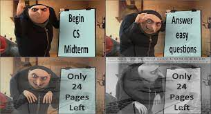
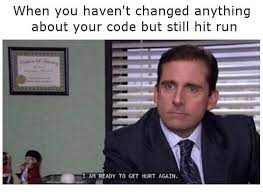
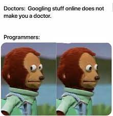

# **[Melissa Ignacio](Melissa_Ignacio.png)**
###### *B.S. Computer Science*
###### mignacio@ucsd.edu


## [Quote](https://melissaignacio.github.io/MelissaIgnacio/#refrences)
Edsger W. Dijkstra said:
> Computer Science is no more about computers than astronomy is about telescopes.

## Fun Facts
My first line of code:
```
System.out.println("Hello World!)
```

My current favorite class is [CSE 110](https://canvas.ucsd.edu/courses/30736). 

## [Skills](https://en.wikipedia.org/wiki/Programming_language)
* Java
* C/C++
* Python

## [Current Classes](https://canvas.ucsd.edu/)
1. CSE 110
2. CSE 142
3. CSE 142L
4. MATH 20C

## TODOs
- [x] Lab 1
- [ ] Lab 2
- [ ] Lab 3
- [ ] etc

## Favorite Memes




## Refrences
https://www.devtopics.com/101-more-great-computer-quotes/
